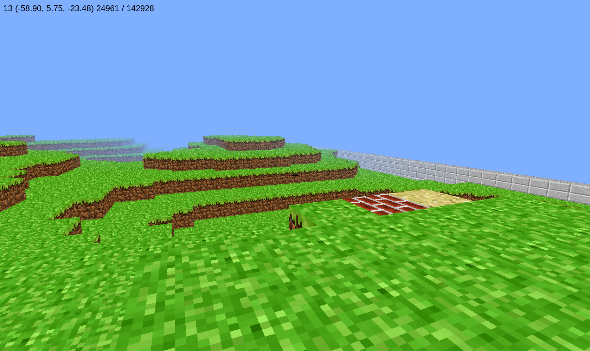

.. image:: https://travis-ci.org/traverseda/pycraft.svg?branch=master
    :target: https://travis-ci.org/traverseda/pycraft
.. image:: https://coveralls.io/repos/github/traverseda/pycraft/badge.svg?branch=master 
    :target: https://coveralls.io/github/traverseda/pycraft?branch=master 

PyCraft
=======

A community driven fork of `foglemans "Minecraft"
repo <https://github.com/fogleman/Minecraft>`_.

|#pycraft on freenode|

Motivation
----------

Python is somewhat poorly suited for game development. However it is well suited
to data-science. A lot of our tasks, working with large voxels sets, strongly resemble
the kind of problems you encounter in data science.

The big advantage comes from limiting "real-time" state. By not relying on anything having to
happen *now*, we can do more complicated computation. At the low-end, that means we can
implement much more complicated occluding algorithms, and thus draw more complicated scenes.

This kind of split could also be used to run more complicated types of operations, like
a cellular automata crudely simulating things like plant growth or water.

When possible, we would prefer to "scale-out". We don't care about outright efficiency too much,
rather we care that our solutions can work for very large or very complicated operations.
The exact opposite of "typical" game development methodology, which would prefer solutions that
"scale-up", solutions that a very fast for the type of data they expect to deal with.

It is currently pre-alpha quality.

Screenshot
----------

Virtual Environment (Recommended)
---------------------------------

.. code:: bash

    # create a virtual environment
    virtualenv -p python3 ~/.venv/pycraft # (or wherever)
    # you may need to add execute permissions
    chmod -R a+x ~/.venv
    # activate
    . ~/.venv/pycraft/bin/activate # on mac
    . ~/.venv/pycraft/Scripts/activate # on windows
    # deactivate (when you're done)
    deactivate

Installing
----------

.. code:: bash

    pip install -e .

**option 1:**

.. code:: bash

    pip install -e .[dev]
    # or: python3 setup.py develop
    pycraft

**option 2:**

.. code:: bash

    python -m pycraft
    # or: python3 -m pycraft

Features
--------

* Support for python 3.5
* Simple Perlin Noise terrain generator
* Object-oriented blocks system

How to Play
-----------

Moving
~~~~~~

-  W: forward
-  S: back
-  A: strafe left
-  D: strafe right
-  Mouse: look around
-  Space: jump
-  Tab: toggle flying mode

Building
~~~~~~~~

-  Selecting the type of block to create:

   -  1: brick
   -  2: grass
   -  3: sand

-  Mouse left-click: remove block
-  Mouse right-click: create block

Quitting
~~~~~~~~

-  ESC: release mouse, then close window

.. |#pycraft on freenode| image:: https://img.shields.io/badge/chat-on%20freenode-brightgreen.svg
   :target: https://kiwiirc.com/client/irc.freenode.net/#pycraft

Contributing
------------

We support and encourage contributions.

Attributions
------------

The game textures
"`Piehole <http://piehole.alexvoelk.de/>`__"
by
`Alex Voelk <http://www.alexvoelk.de/>`__
is licensed under
`CC BY 3.0 <https://creativecommons.org/licenses/by/3.0/>`__.
